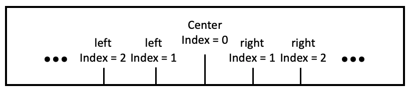
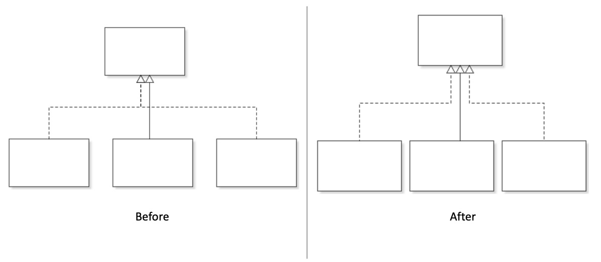
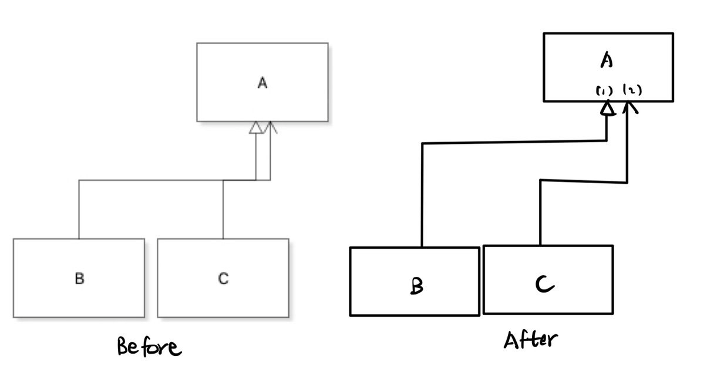
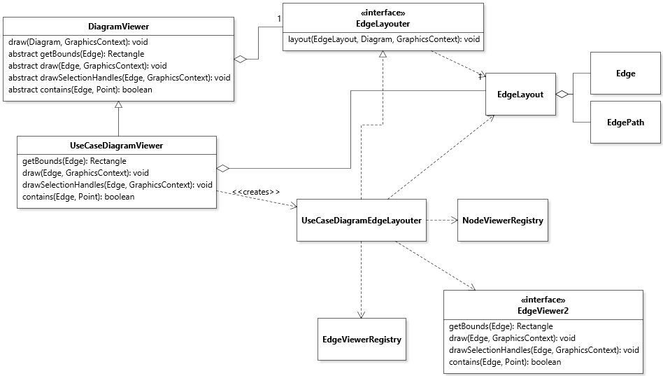
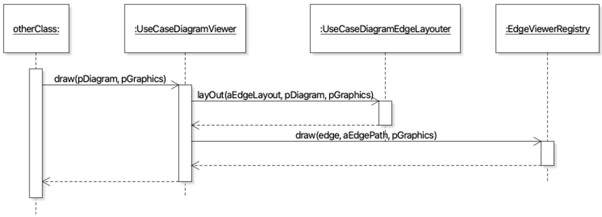

# Diagram Layout

## Edge layout algorithm for class diagram

The purpose of updating the edge layout algorithm is to make it smarter and avoid as many edge crossings as possible. In order to do this, we established the rules below.

**Definition of position**

We first define the concept of position on a side of a node. The midpoint of a node side would be the central point with an index of 0. Based on the central point, we increment the index separately on both the left and right sides. This concept would be used in the explanations below.

**Edge category**

We categorize edges based on their visual appearance. For example, implementation edges, extension edges, composition edges, etc.

**Priority rule**

Base on the edge category, we establish a priority rule so that edges in one category with higher priority get drawn first. For example, suppose we have extension edges with higher priority than the implementation edges, the extension edges would always be assigned a more centred position compared with implementation edges.

**Edge aggregation and node position**

The edges with the highest priority among all the edges on the same node side would always take the central position as the connection point. All the edges within the same category would be aggregated. 

In contrast, for those edges that could not take the central position, we would only aggregate those edges within the same category if they are on the same side of the node. Otherwise, we would separate them to avoid edge crossings. 

In figure below (The "after" diagram is drawn from [this commit](https://github.com/yingjie-xu/JetUML/commit/fa2511ee983cbcbb83d177d24b8f53652cd1933d)), the extension edge has the highest priority so it takes the central position. The other two implementation edges are on different sides of the target node, so we do not aggregate those two edges even they are within the same edge category. 

**Optimize the edge path**

After applying the rules above, we would consider the whole layout of all the edge paths and try to avoid edge crossings by adjusting the turning points on the edge paths. An example of this optimization could be seen in the figure below.

**Stateful drawing design**

In order to achieve this design, moving away from the stateless edge drawing design would be necessary. The updated stateful design is covered in next section.

## Layouter design

As described in the previous section, we need a stateful drawing design to achieve the updated algorithm. Layouter is designed to solve this problem. It is an additional layer of indirection between the DiagramViewer and the EdgeViewers. Previously, DiagramViewer would iteratively send each edge to its corresponding EdgeViewer, and EdgeViewers would not only calculate the edge path but also draw the edges. By adding the layouter, we would separate the responsibility of calculating edge paths from EdgeViewers to the layouters. Since the layouter is calculating edge paths for all the edges on the diagram, it is stateful and it allows us to calculate new paths based on previously calculated paths.

We would use the Use Case diagram as an example in this section. As shown in the figure below, we added an interface named EdgeLayouter. It has a layout method that would take EdgeLayout as a parameter. EdgeLayout is basically a wrapper for the HashMap which uses Edge as a key and its EdgePath as the value. EdgePath is an array of points that represents the edge path. The goal of calling the layout method is to calculate the EdgeLayout for the corresponding diagram. Inside the DiagramViewer, we would create a single instance of the corresponding Layouter.

By calling the draw method inside DiagramViewer, we would do two things. The first one is to calculate the edge path by calling the layout method from Layouter. The second one is to find the corresponding EdgeViewer and draw that edge by using the EdgePath calculated from the previous step. Another thing I did not explicitly draw in the sequence diagram is that we could cache the results for getBounds method since we have stored the result inside the EdgeLayout instance.

**Responsibilities:**

- DiagramViewer should be responsible for calling the corresponding layouter and storing the cached results. 
- Layouter should only be responsible for planning the path and position for all the edges. 
- EdgeViewer should use pre-calculated edge paths to draw the actual edges.

The stateful layouter design is quite beneficial. It applies the separation of concerns principle. The DiagramViewer could cache the edge layout for future queries. An example of that would be caching the results of the getBounds method in a HashMap. The layouter could take all the edges on the diagram into consideration when planning the new edge paths and avoid as many edge crossings as possible. The EdgeViewer would only need to draw the edges by using the resulting edge paths provided by the layouter.